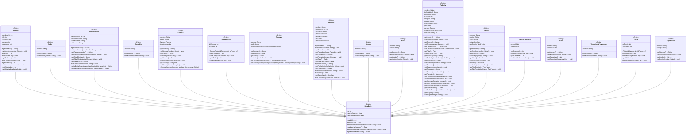

```mermaid
classDiagram
    class Asiento {
        <<Entity>>
        -nombre: String
        -fila: int
        -columna: int
        -numero: int
        -adaptado: int
        +getNombre(): String
        +setNombre(nombre: String): void
        +getFila(): int
        +setFila(fila: int): void
        +getColumna(): int
        +setColumna(columna: int): void
        +getNumero(): int
        +setNumero(numero: int): void
        +getAdaptado(): int
        +setAdaptado(adaptado: int): void
    }

    class Audio {
        <<Entity>>
        -nombre: String
        +getNombre(): String
        +setNombre(nombre: String): void
    }

    class BaseEntity {
        <<Entity>>
        -id: int
        -fechaCreacion: Date
        -fechaModificacion: Date
        +getId(): int
        +setId(id: int): void
        +setFechaCreacion(fechaCreacion: Date): void
        +getFechaCreacion(): Date
        +setFechaModificacion(fechaModificacion: Date): void
        +getFechaModificacion(): Date
    }

    class Clasificacion {
        <<Entity>>
        -identificador: String
        -recomendacion: String
        -edadMinima: String
        -definicion: String
        +getIdentificador(): String
        +setIdentificador(identificador: String): void
        +getRecomendacion(): String
        +setRecomendacion(recomendacion: String): void
        +getEdadMinima(): String
        +setEdadMinima(edadMinima: String): void
        +getDefinicion(): String
        +setDefinicion(definicion: String): void
        +buildEntityArrayAsJson(clasificacionList: ArrayList<Clasificacion>): String
        +buildEntityAsJson(clasificacion: Clasificacion): String
    }

    class Complejo {
        <<Entity>>
        -nombre: String
        +getNombre(): String
        +setNombre(nombre: String): void
    }

    class Compra {
        <<Entity>>
        -nombre: String
        -email: String
        -funcion: Funcion
        -tickets: ArrayList<Ticket>
        +getNombre(): String
        +setNombre(nombre: String): void
        +getEmail(): String
        +setEmail(email: String): void
        +getFuncion(): Funcion
        +setFuncion(funcion: Funcion): void
        +getTickets(): ArrayList<Ticket>
        +setTickets(tickets: ArrayList<Ticket>): void
        +Compra(funcion: Funcion, nombre: String, email: String)
    }

    class CompraTicket {
        <<Entity>>
        -idCompra: int
        -idTicket: int
        +CompraTicket(idCompra: int, idTicket: int)
        +getIdCompra(): int
        +setIdCompra(idCompra: int): void
        +getIdTicket(): int
        +setIdTicket(idTicket: int): void
    }

    class Formato {
        <<Entity>>
        -nombre: String
        -audio: Audio
        -tecnologiaProyeccion: TecnologiaProyeccion
        +getNombre(): String
        +setNombre(): void
        +getAudio(): Audio
        +setAudio(audio: Audio): void
        +getTecnologiaProyeccion(): TecnologiaProyeccion
        +setTecnologiaProyeccion(tecnologiaProyeccion: TecnologiaProyeccion): void
    }

    class Funcion {
        <<Entity>>
        -nombre: String
        -fechaInicio: String
        -horaInicio: String
        -pelicula: Pelicula
        -formato: Formato
        -sala: Sala
        -cancelada: boolean
        +getNombre(): String
        +setNombre(nombre: String): void
        +getPelicula(): Pelicula
        +setPelicula(pelicula: Pelicula): void
        +getFormato(): Formato
        +setFormato(formato: Formato): void
        +getSala(): Sala
        +setSala(sala: Sala): void
        +getFechaInicio(): String
        +setFechaInicio(fechaInicio: String): void
        +getHoraInicio(): String
        +setHoraInicio(horaInicio: String): void
        +cancelar(): void
        +getCancelada(): boolean
        +setCancelada(cancelada: boolean): void
    }

    class Genero {
        <<Entity>>
        -nombre: String
        +getNombre(): String
        +setNombre(nombre: String): void
    }

    class Pais {
        <<Entity>>
        -nombre: String
        -codigo: String
        +getNombre(): String
        +setNombre(nombre: String): void
        +getCodigo(): String
        +setCodigo(codigo: String): void
    }

    class Pelicula {
        <<Entity>>
        -nombre: String
        -tituloOriginal: String
        -tituloPais: String
        -duracion: int
        -sinopsis: String
        -imagen: String
        -fechaEstreno: Date
        -pais: Pais
        -genero: Genero
        -clasificacion: Clasificacion
        -formatos: ArrayList<Formato>
        +getNombre(): String
        +setNombre(nombre: String): void
        +getGenero(): Genero
        +setGenero(genero: Genero): void
        +getClasificacion(): Clasificacion
        +setClasificacion(clasificacion: Clasificacion): void
        +getPais(): Pais
        +setPais(pais: Pais): void
        +getTituloOriginal(): String
        +setTituloOriginal(tituloOriginal: String): void
        +getTituloPais(): String
        +setTituloPais(tituloPais: String): void
        +getDuracion(): int
        +setDuracion(duracion: int): void
        +getSinopsis(): String
        +setSinopsis(sinopsis: String): void
        +getFormatos(): ArrayList<Formato>
        +setFormatos(formatos: ArrayList<Formato>): void
        +addFormato(formatos: ArrayList<Formato>): void
        +addFormato(formato: Formato): void
        +removeFormato(formatos: ArrayList<Formato>): void
        +removeFormato(formato: Formato): void
        +getFechaEstreno(): Date
        +setFechaEstreno(fechaEstreno: Date): void
        +getImagen(): String
        +setImagen(imagen: String): void
    }

    class Precio {
        <<Entity>>
        -nombre: String
        -codigo: String
        -valor: double
        -activo: boolean
        -tipoPrecio: TipoPrecio
        +getNombre(): String
        +setNombre(nombre: String): void
        +getCodigo(): String
        +setCodigo(codigo: String): void
        +getValor(): double
        +setValor(valor: double): void
        +isActivo(): boolean
        +setActivo(activo: boolean): void
        +getTipoPrecio(): TipoPrecio
        +setTipoPrecio(tipoPrecio: TipoPrecio): void
    }

    class PrecioCantidad {
        -precioId: int
        -cantidad: int
        +getPrecioId(): int
        +setPrecioId(precioId: int): void
        +getCantidad(): int
        +setCantidad(cantidad: int): void
    }

    class Sala {
        <<Entity>>
        -nombre: String
        -capacidad: int
        +getNombre(): String
        +setNombre(nombre: String): void
        +getCapacidad(): int
        +setCapacidad(capacidad: int): void
    }

    class TecnologiaProyeccion {
        <<Entity>>
        -nombre: String
        +getNombre(): String
        +setNombre(nombre: String): void
    }

    class Ticket {
        <<Entity>>
        -idPrecio: int
        -idAsiento: int
        +Ticket(idAsiento: int, idPrecio: int)
        +getIdPrecio(): int
        +setIdPrecio(idPrecio: int): void
        +getIdAsiento(): int
        +setIdAsiento(idAsiento: int): void
    }

    class TipoPrecio {
        <<Entity>>
        -nombre: String
        -codigo: String
        +getNombre(): String
        +setNombre(nombre: String): void
        +getCodigo(): String
        +setCodigo(codigo: String): void
    }

    Asiento --|> BaseEntity
    Audio --|> BaseEntity
    Clasificacion --|> BaseEntity
    Complejo --|> BaseEntity
    Compra --|> BaseEntity
    CompraTicket --|> BaseEntity
    Formato --|> BaseEntity
    Funcion --|> BaseEntity
    Genero --|> BaseEntity
    Pais --|> BaseEntity
    Pelicula --|> BaseEntity
    Precio --|> BaseEntity
    PrecioCantidad --|> BaseEntity
    Sala --|> BaseEntity
    TecnologiaProyeccion --|> BaseEntity
    Ticket --|> BaseEntity
    TipoPrecio --|> BaseEntity

```