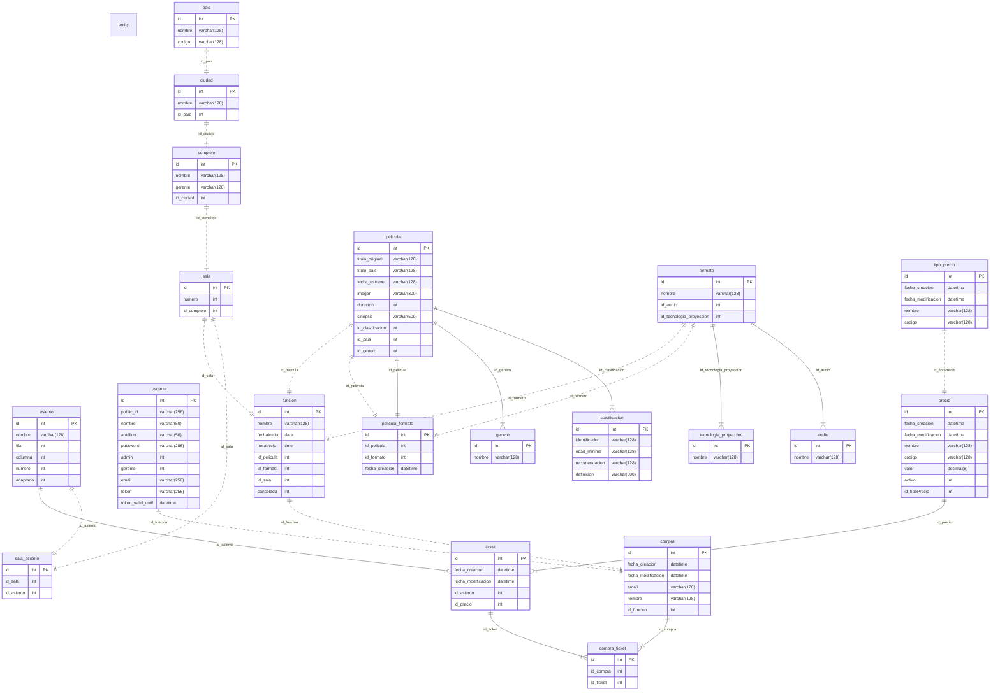

```mermaid
erDiagram
    entity "pais" {
        id int PK
        nombre varchar(128)
        codigo varchar(128)
    }
    entity "ciudad" {
        id int PK
        nombre varchar(128)
        id_pais int
    }
    entity "complejo" {
        id int PK
        nombre varchar(128)
        gerente varchar(128)
        id_ciudad int
    }
    entity "sala" {
        id int PK
        numero int
        id_complejo int
    }
    entity "sala_asiento" {
        id int PK
        id_sala int
        id_asiento int
    }
    entity "asiento" {
        id int PK
        nombre varchar(128)
        fila int
        columna int
        numero int
        adaptado int
    }
    entity "usuario" {
        id int PK
        public_id varchar(256)
        nombre varchar(50)
        apellido varchar(50)
        password varchar(256)
        admin int
        gerente int
        email varchar(256)
        token varchar(256)
        token_valid_until datetime
    }
    entity "clasificacion" {
        id int PK
        identificador varchar(128)
        edad_minima varchar(128)
        recomendacion varchar(128)
        definicion varchar(500)
    }
    entity "genero" {
        id int PK
        nombre varchar(128)
    }
    entity "pelicula" {
        id int PK
        titulo_original varchar(128)
        titulo_pais varchar(128)
        fecha_estreno varchar(128)
        imagen varchar(300)
        duracion int
        sinopsis varchar(500)
        id_clasificacion int
        id_pais int
        id_genero int
    }
    entity "pelicula_formato" {
        id int PK
        id_pelicula int
        id_formato int
        fecha_creacion datetime
    }
    entity "formato" {
        id int PK
        nombre varchar(128)
        id_audio int
        id_tecnologia_proyeccion int
    }
    entity "audio" {
        id int PK
        nombre varchar(128)
    }
    entity "tecnologia_proyeccion" {
        id int PK
        nombre varchar(128)
    }
    entity "funcion" {
        id int PK
        nombre varchar(128)
        fechaInicio date
        horaInicio time
        id_pelicula int
        id_formato int
        id_sala int
        cancelada int
    }
    entity "compra" {
        id int PK
        fecha_creacion datetime
        fecha_modificacion datetime
        email varchar(128)
        nombre varchar(128)
        id_funcion int
    }
    entity "ticket" {
        id int PK
        fecha_creacion datetime
        fecha_modificacion datetime
        id_asiento int
        id_precio int
    }
    entity "compra_ticket" {
        id int PK
        id_compra int
        id_ticket int
    }
    entity "precio" {
        id int PK
        fecha_creacion datetime
        fecha_modificacion datetime
        nombre varchar(128)
        codigo varchar(128)
        valor decimal(8)
        activo int
        id_tipoPrecio int
    }
    entity "tipo_precio" {
        id int PK
        fecha_creacion datetime
        fecha_modificacion datetime
        nombre varchar(128)
        codigo varchar(128)
    }

    pais ||..|| ciudad : id_pais
    ciudad ||..|| complejo : id_ciudad
    complejo ||..|| sala : id_complejo
    sala ||..|| sala_asiento : id_sala
    asiento ||..|| sala_asiento : id_asiento
    usuario ||..|| compra : id_funcion
    funcion ||..|| compra : id_funcion
    pelicula ||--|{ clasificacion : id_clasificacion
    pelicula ||--|{ genero : id_genero
    pelicula ||--|| pelicula_formato : id_pelicula
    formato ||--|{ audio : id_audio
    formato ||--|{ tecnologia_proyeccion : id_tecnologia_proyeccion
    pelicula ||..|| pelicula_formato : id_pelicula
    formato ||..|| pelicula_formato : id_formato
    sala ||..|| funcion : id_sala
    pelicula ||..|| funcion : id_pelicula
    formato ||..|| funcion : id_formato
    compra ||--|{ compra_ticket : id_compra
    ticket ||--|{ compra_ticket : id_ticket
    asiento ||--|{ ticket : id_asiento
    precio ||--|{ ticket : id_precio
    tipo_precio ||..|| precio : id_tipoPrecio

```
