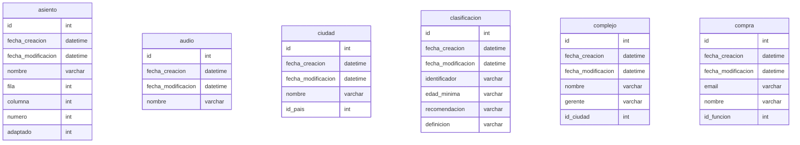

```mermaid
erDiagram
    asiento {
      id int
      fecha_creacion datetime
      fecha_modificacion datetime
      nombre varchar
      fila int
      columna int
      numero int
      adaptado int
    }

    audio {
      id int
      fecha_creacion datetime
      fecha_modificacion datetime
      nombre varchar
    }

    ciudad {
      id int
      fecha_creacion datetime
      fecha_modificacion datetime
      nombre varchar
      id_pais int
    }

    clasificacion {
      id int
      fecha_creacion datetime
      fecha_modificacion datetime
      identificador varchar
      edad_minima varchar
      recomendacion varchar
      definicion varchar
    }

    complejo {
      id int
      fecha_creacion datetime
      fecha_modificacion datetime
      nombre varchar
      gerente varchar
      id_ciudad int
    }

    compra {
      id int
      fecha_creacion datetime
      fecha_modificacion datetime
      email varchar
      nombre varchar
      id_funcion int
    }
```
